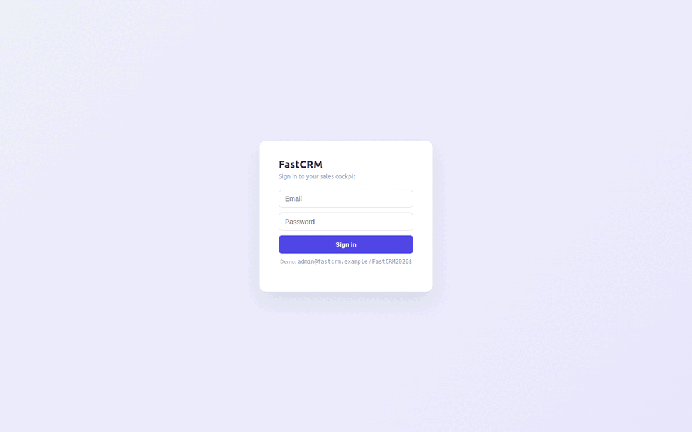

# FastCRM

**FastCRM** is an open-source **sales CRM** built with
[FastHTML](https://fastht.ml) — a server-side, HTMX-driven reimagining of the
core of [Frappe CRM](https://github.com/frappe/crm). Python-first, no JavaScript
framework: leads, a Kanban deal pipeline, contacts, organizations, tasks, an
activity timeline, and an AI assistant grounded in your live data.

*Simplify sales, amplify relationships.* Runs on port **5006**.

> **Synthetic data only — no PII.** Everything ships and runs on deterministic,
> fully synthetic data generated by `seed.py`. There are no real people or
> companies anywhere in this repository.

## Demo

A click-through of the key screens (regenerate any time with
`scripts/build_demo_gif.sh`):



## Quickstart (native)

```bash
# 1. Virtualenv + dependencies
python -m venv .venv
.venv/bin/python -m pip install -r requirements.txt

# 2. Configure (optional — the app self-seeds and runs without any key)
cp .env.sample .env        # then add an LLM key for free-form AI chat

# 3. Run (builds the synthetic SQLite DB on first boot)
.venv/bin/python web_app.py        # http://localhost:5006
```

Login: `admin@fastcrm.example` / `FastCRM2026$` (override via `FASTCRM_ADMIN_*`
in `.env`). Rebuild the demo data any time with `.venv/bin/python seed.py`.

## Run with Docker

```bash
# Put your keys in .env (compose auto-loads it), then:
docker compose up --build           # http://localhost:5006
```

`Dockerfile` (python:3.12-slim, port 5006) seeds the database on first boot.
`docker-compose.yml` mounts a `fastcrm-data` volume at `/data` so the SQLite
database lives outside the image and survives rebuilds.

## Module tour

- **Dashboard** (`/`) — KPI cards (open deals & value, won value, win rate, new
  leads, open tasks), a pipeline funnel by stage, the top open deals, and a live
  activity feed.
- **Deals** (`/deals`) — a Kanban board across the seven pipeline stages
  (Qualification → … → Won / Lost). Click any card for the full deal: facts,
  primary contact, tasks, and a chronological activity timeline.
- **Leads** (`/leads`) — status-segmented, searchable lead register with
  per-lead drilldown.
- **Tasks** (`/tasks`) — open work across all deals, filterable by status.
- **Contacts** (`/contacts`) & **Organizations** (`/organizations`) — the people
  directory and the companies they belong to, ranked by won value.
- **AI Assistant** (right rail) — chat over a **live snapshot** of your CRM.
  Plain-English questions stream from a configurable LLM provider (xAI / OpenAI /
  Anthropic / Google); **slash-commands** (`/pipeline`, `/deals`, `/leads`,
  `/tasks`, `/kpi`, `/org <name>`, `/help`) resolve instantly with **no API key**.

## Configuration

All via `.env` (see `.env.sample`). Free-form AI chat needs one provider:

```ini
MODEL_PROVIDER=xai          # xai | openai | anthropic | google
MODEL_NAME=grok-4-1-fast-reasoning
XAI_API_KEY=...             # or OPENAI_/ANTHROPIC_/GOOGLE_API_KEY
```

Without a key, the entire app still works and slash-commands answer from SQLite.

## Architecture

Single SQLite file, server-rendered FastHTML, HTMX for interactivity, ~40 lines
of vanilla JS for the streaming chat. See **[SKILLS.md](SKILLS.md)** for the
capability reference **and the reusable Frappe → FastHTML migration playbook**
(including `scripts/frappe_doctype_to_schema.py`, which turns Frappe DocType JSON
into a starting SQLite schema). `FastHTML.md` is the bundled FastHTML reference.

```
web_app.py        routes, auth, SSE chat endpoint, boot
db.py             SQLite schema + domain vocabularies + read helpers
seed.py           deterministic synthetic-data generator
web/layout.py     3-pane shell, CSS design tokens, chat JS
web/views.py      page renderers
web/ai.py         slash-commands + multi-provider streaming chat
scripts/          build_demo_gif.sh · frappe_doctype_to_schema.py
```

## Roadmap

FastCRM ports the **core** of Frappe CRM. A deeper feature comparison against the
upstream repo and the planned additions live in
**[docs/ROADMAP.md](docs/ROADMAP.md)**.

## Licence

MIT. See `LICENSE`. Part of the
[`fasthtml-oss-migrations`](https://github.com/predictivelabsai/fasthtml-oss-migrations)
initiative porting Frappe apps to FastHTML.
