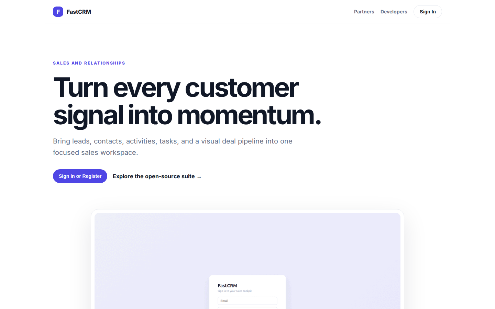
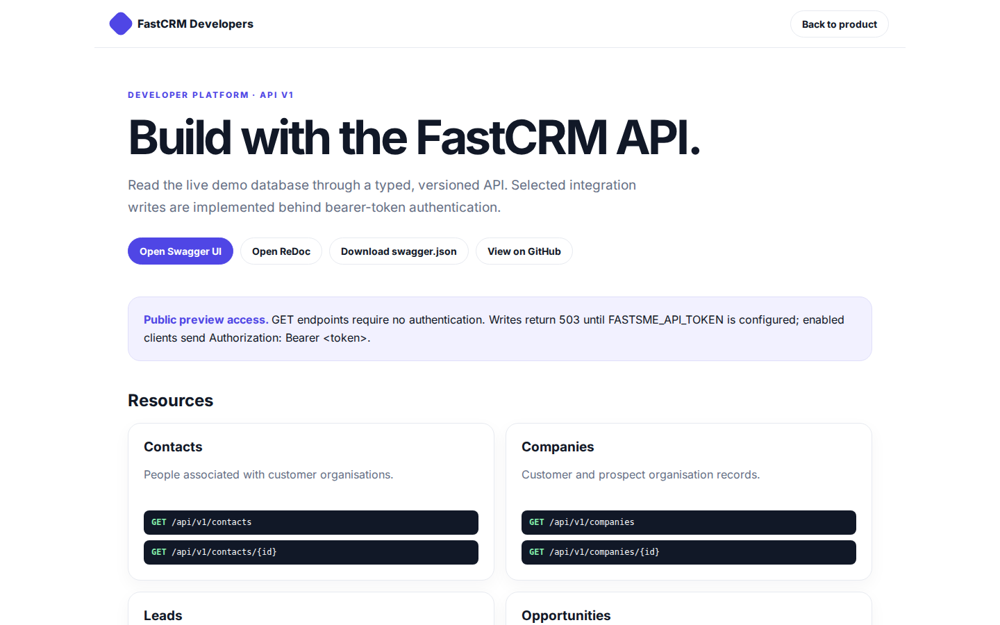

# FastCRM Platform Guide

**Published:** 2026-08-19
**Platform:** [https://crm.fastsme.com](https://crm.fastsme.com)
**Source:** [github.com/predictivelabsai/FastCRM](https://github.com/predictivelabsai/FastCRM)

## Platform overview

**FastCRM** is an open-source **sales CRM** built with — a server-side, HTMX-driven reimagining of the core of . Python-first, no JavaScript framework: leads, a Kanban deal pipeline, contacts, organizations, tasks, an activity timeline, and an AI assistant grounded in your live data.

This visual guide was reviewed against the live product using Playwright. Screens and available navigation can vary by account, role, and deployment configuration.

## 1. Turn every customer signal into momentum.

SALES AND RELATIONSHIPS Turn every customer signal into momentum. Bring leads, contacts, activities, tasks, and a visual deal pipeline into one focused sales workspace. Sign In or Register Explore the open-source suite → Product tour · see the workspace in act

Screen reviewed at: [https://crm.fastsme.com/](https://crm.fastsme.com/)

## 2. Build with the FastCRM API.

FastCRM Developers Back to product DEVELOPER PLATFORM · API V1 Build with the FastCRM API. Read the live demo database through a typed, versioned API. Selected integration writes are implemented behind bearer-token authentication. Open Swagger UI Open ReDoc Do

Screen reviewed at: [https://crm.fastsme.com/developers](https://crm.fastsme.com/developers)

## 3. Sign in

Sign in with Google Sign in to continue to fastsme.com Email or phone Forgot email? Next Create account Afrikaans azərbaycan bosanski català Čeština Cymraeg Dansk Deutsch eesti English (United Kingdom) English (United States) Español (España) Español (Latinoam

Screen reviewed at: [https://accounts.google.com/v3/signin/identifier?opparams=%253F&dsh=S772928290%3A1787122643639021&access_type=online&client_id=887059023987-2a7spj1m82eivobdbt1itb3cqca6tpt1.apps.googleusercontent.com&o2v=2&prompt=select_account&redirect_uri=https%3A%2F%2Fcrm.fastsme.com%2Fauth%2Fgoogle%2Fcallback&response_type=code&scope=openid+email+profile&service=lso&state=9QMpeN8_PDHAJBVhe2UIG2YTiPPSJ23G_x6VzoI3ug4&flowName=GeneralOAuthLite&continue=https%3A%2F%2Faccounts.google.com%2Fsignin%2Foauth%2Flegacy%2Fconsent%3Fauthuser%3Dunknown%26part%3DAJi8hAPQ-2hHAaZEOzRgsAjese8CFYlhFl1t3fnDq3mI-7_HIigEQOFgZOQUf8pzgzd9c27SCdjky-ddISMKyYobGQOJKWKTAQ4wiu90c8C9Xjo8szy5sRTIzrBq5MZwaDR9-gz2h5Up1eI67l2_tLxhZ3htKkiqaPPfF5TXEjeCeg6OndtqgjdOpIYbhzzYWIC3tauwlQShnzXIetzsF9WpwhNO4ut-N-lRK8plOQDII2wUgmbhSox7oyEVL0a42my9uH-m5sPtUsyagF3kfz3bacy0iM0x3H4x6FB6xOABfwrfwF3Bl2uF3VLxSTXd8Vrvefv9q7hwFpv8gHjEPHsgImY93rkLFgtXhP5-6HUvY_QTiTgjKXPCDxrSnW9hcEONyrTF-rMSZoQF6HJOa-G7V4dAv1nBNEGWPFcDSY82UJ3YL1qmm2TSSlbpXCpo7ktdOnsm9qynQORK8iKvl8Z_tZIcaC6Xzg%26flowName%3DGeneralOAuthFlow%26as%3DS772928290%253A1787122643639021%26client_id%3D887059023987-2a7spj1m82eivobdbt1itb3cqca6tpt1.apps.googleusercontent.com%23&app_domain=https%3A%2F%2Fcrm.fastsme.com&rart=ANgoxceFpCK4Il7JZ6W05TYYZpJ0-mZmyEhk2NJp18MUEZZGltNgUoIHhxm7zZ87MScQRht1_3UCg4NUL8o06ikjst70VxrTbqEEjFosxaDkm9yIdmG0RtM](https://accounts.google.com/v3/signin/identifier?opparams=%253F&dsh=S772928290%3A1787122643639021&access_type=online&client_id=887059023987-2a7spj1m82eivobdbt1itb3cqca6tpt1.apps.googleusercontent.com&o2v=2&prompt=select_account&redirect_uri=https%3A%2F%2Fcrm.fastsme.com%2Fauth%2Fgoogle%2Fcallback&response_type=code&scope=openid+email+profile&service=lso&state=9QMpeN8_PDHAJBVhe2UIG2YTiPPSJ23G_x6VzoI3ug4&flowName=GeneralOAuthLite&continue=https%3A%2F%2Faccounts.google.com%2Fsignin%2Foauth%2Flegacy%2Fconsent%3Fauthuser%3Dunknown%26part%3DAJi8hAPQ-2hHAaZEOzRgsAjese8CFYlhFl1t3fnDq3mI-7_HIigEQOFgZOQUf8pzgzd9c27SCdjky-ddISMKyYobGQOJKWKTAQ4wiu90c8C9Xjo8szy5sRTIzrBq5MZwaDR9-gz2h5Up1eI67l2_tLxhZ3htKkiqaPPfF5TXEjeCeg6OndtqgjdOpIYbhzzYWIC3tauwlQShnzXIetzsF9WpwhNO4ut-N-lRK8plOQDII2wUgmbhSox7oyEVL0a42my9uH-m5sPtUsyagF3kfz3bacy0iM0x3H4x6FB6xOABfwrfwF3Bl2uF3VLxSTXd8Vrvefv9q7hwFpv8gHjEPHsgImY93rkLFgtXhP5-6HUvY_QTiTgjKXPCDxrSnW9hcEONyrTF-rMSZoQF6HJOa-G7V4dAv1nBNEGWPFcDSY82UJ3YL1qmm2TSSlbpXCpo7ktdOnsm9qynQORK8iKvl8Z_tZIcaC6Xzg%26flowName%3DGeneralOAuthFlow%26as%3DS772928290%253A1787122643639021%26client_id%3D887059023987-2a7spj1m82eivobdbt1itb3cqca6tpt1.apps.googleusercontent.com%23&app_domain=https%3A%2F%2Fcrm.fastsme.com&rart=ANgoxceFpCK4Il7JZ6W05TYYZpJ0-mZmyEhk2NJp18MUEZZGltNgUoIHhxm7zZ87MScQRht1_3UCg4NUL8o06ikjst70VxrTbqEEjFosxaDkm9yIdmG0RtM)

## Getting started

Visit [https://crm.fastsme.com](https://crm.fastsme.com) to explore FastCRM. For source code and deployment details, use the GitHub link above.
